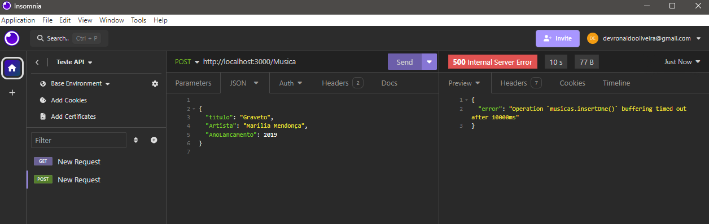
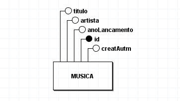

# Web_API
 API de músicas

## Tecnologias Utilizadas

* Node.js
* Express
* Mongoose
* JavaScript
* Nodemon
* MongoDB

## Ambientes Utilizados
* Visual Studio Code
* BrModelo

# problemas 
Devido a conexão e falha do ambiente Insomnia, não foi possível alimentar o banco de dados. Posteriormente correções serão feitas.

## Modelo Conceitual

## Referências
[Youtube](https://youtu.be/lZ1Xa930O6Q?si=PYvd57a69YXW84OD)

## Licenças 
* MIT license
